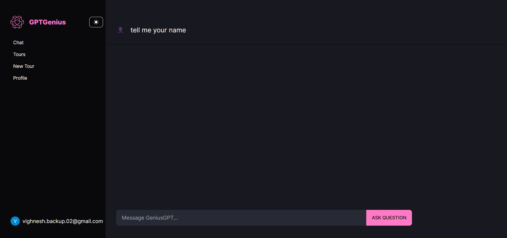

# GPT-Genius

Welcome to GPT-Genius, your intelligent tour planning platform powered by OpenAI's cutting-edge technology. GPT-Genius leverages the power of AI to help users plan their dream tours seamlessly. This README will guide you through the project structure, dependencies, and key features of GPT-Genius.

## Overview

GPT-Genius is built to offer users a personalized tour planning experience. By combining user inputs with powerful AI capabilities, the platform generates custom tour plans, facilitates interactive chat with tour guides, and enables users to explore tours created by others.

## Features

1. **User Authentication**: New users can sign up securely, and upon registration, they are allocated 1000 tokens for tour planning activities.

2. **Interactive Chat with AI Tour Guide**: Users can engage in conversations with an AI-powered tour guide. The AI maintains context across interactions for a personalized experience.

3. **Custom Tour Planning**: Users can input destination details such as city name, country name, and traveling partner preferences. Based on these inputs, the AI generates personalized tour plans.

4. **Tour Sharing**: Users can explore tours created by other users, providing inspiration and ideas for their own travels.

5. **AI-Generated Tours Cache**: AI-generated tours are intelligently cached in a PostgreSQL database, ensuring quick access and seamless user experience.

6. **Day/Night mode**: User can switch between light and dark theme.

## Tech Stack

- **Next.js**: Used for frontend development, offering a fast and efficient React framework.
- **React**: Powers the interactive user interface for a smooth user experience.
- **Tailwind CSS**: Provides a utility-first CSS framework for quick and responsive styling.
- **Prisma**: Integrates with PostgreSQL to store and manage AI-generated tour plans.
- **OpenAI**: Utilized for AI capabilities, enabling chat interactions and tour planning based on user inputs.
- **React Query**: Facilitates data fetching and caching for optimized performance.
- **Axios**: Handles HTTP requests for seamless communication between frontend and backend.

## Getting Started

1. **Clone the Repository**:
   ```bash
   git clone https://github.com/VighneshManjrekar/gpt-genius.git
   cd gpt-genius
   ```

2. **Install Dependencies**:
   ```bash
   npm install
   ```

3. **Set Up Environment Variables**:
   - Create a `.env` file based on `.env.example` and `.env.local` file based on `.env.local.example`. Fill in the necessary variables like database credentials, API keys, etc.

4. **Run the Development Server**:
   ```bash
   npm run dev
   ```

5. **Access the Application**:
   Open your browser and visit `http://localhost:3000` to access the GPT-Genius platform.

## Demo

[](https://youtu.be/mpSAPnM00Ys)

Click on the image above to watch the demo video.